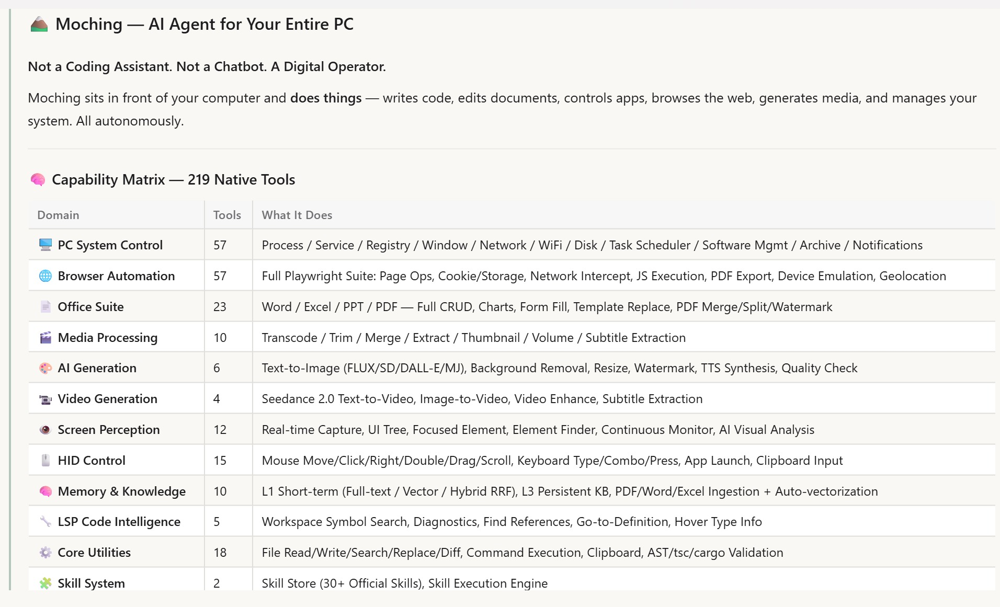
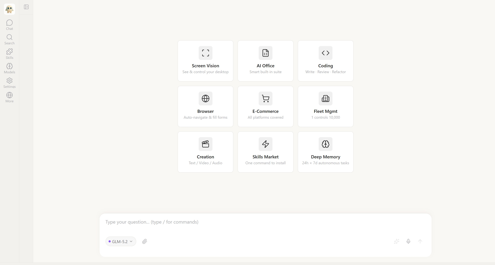
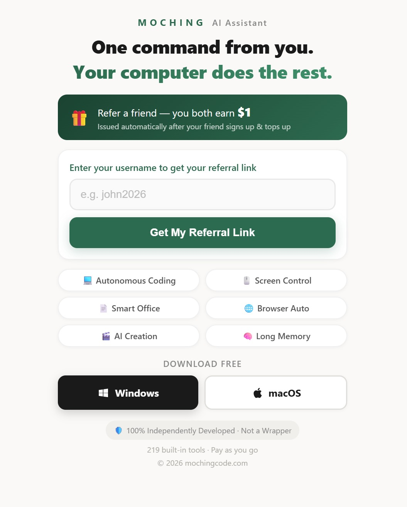

# 🏔️ Moching — AI Agent for Your Entire PC

<p align="center">
  
</p>

<p align="center">
  
  
  
  
  <a href="https://mochingcode.com"></a>
</p>

### Not a Coding Assistant. Not a Chatbot. A Digital Operator.

Moching sits in front of your computer and **does things** — writes code, edits documents, controls apps, browses the web, generates media, and manages your system. All autonomously.

<p align="center">
  
</p>

---

## 🧠 Capability Matrix — 219 Native Tools

| Domain | Tools | What It Does |
|---|---|---|
| 🖥️ **PC System Control** | 57 | Process / Service / Registry / Window / Network / WiFi / Disk / Task Scheduler / Software Mgmt / Archive / Notifications |
| 🌐 **Browser Automation** | 57 | Full Playwright Suite: Page Ops, Cookie/Storage, Network Intercept, JS Execution, PDF Export, Device Emulation, Geolocation |
| 📄 **Office Suite** | 23 | Word / Excel / PPT / PDF — Full CRUD, Charts, Form Fill, Template Replace, PDF Merge/Split/Watermark |
| 🎬 **Media Processing** | 10 | Transcode / Trim / Merge / Extract / Thumbnail / Volume / Subtitle Extraction |
| 🎨 **AI Generation** | 6 | Text-to-Image (FLUX/SD/DALL-E/MJ), Background Removal, Resize, Watermark, TTS Synthesis, Quality Check |
| 📹 **Video Generation** | 4 | Seedance 2.0 Text-to-Video, Image-to-Video, Video Enhance, Subtitle Extraction |
| 👁️ **Screen Perception** | 12 | Real-time Capture, UI Tree, Focused Element, Element Finder, Continuous Monitor, AI Visual Analysis |
| 🖱️ **HID Control** | 15 | Mouse Move/Click/Right/Double/Drag/Scroll, Keyboard Type/Combo/Press, App Launch, Clipboard Input |
| 🧠 **Memory & Knowledge** | 10 | L1 Short-term (Full-text / Vector / Hybrid RRF), L3 Persistent KB, PDF/Word/Excel Ingestion + Auto-vectorization |
| 🔧 **LSP Code Intelligence** | 5 | Workspace Symbol Search, Diagnostics, Find References, Go-to-Definition, Hover Type Info |
| ⚙️ **Core Utilities** | 18 | File Read/Write/Search/Replace/Diff, Command Execution, Clipboard, AST/tsc/cargo Validation |
| 🧩 **Skill System** | 2 | Skill Store (30+ Official Skills), Skill Execution Engine |

---

## ⚔️ Competitive Landscape

| Capability | 🏔️ **Moching** | GitHub Copilot | Cursor | Qoder |
|---|---|---|---|---|
| **Positioning** | Desktop AI Agent | IDE Code Completion | AI Code Editor | CLI Coding Tool |
| **Desktop HID Control** | ✅ Full + Screen Perception | ❌ | ❌ | ❌ |
| **System-Level Control** | ✅ Process/Service/Registry/Net | ❌ | ❌ | ❌ |
| **Browser Automation** | ✅ Playwright (57 tools) | ❌ | Basic | Limited |
| **Office Document Suite** | ✅ Word/Excel/PPT/PDF | ❌ | ❌ | ❌ |
| **Media & Video Generation** | ✅ Full Pipeline + AI Video | ❌ | ❌ | ❌ |
| **AI Image / TTS** | ✅ Multi-provider | ❌ | ❌ | ❌ |
| **Code LSP Intelligence** | ✅ Symbol/Diag/Ref/Def | ✅ Built-in | ✅ Strong | ✅ |
| **Code Editing** | ✅ Precision Replace + Diff | ✅ Completion | ✅✅ Best | ✅ |
| **Terminal Execution** | ✅ No Whitelist | ✅ Limited | ✅ | ✅ Strong |
| **Memory / Knowledge Base** | ✅ L1 + L3 + RAG Ingestion | ❌ | ✅ Code Index | Limited |
| **Screen Visual Understanding** | ✅ Real-time + AI + UI Tree | ❌ | ❌ | ❌ |
| **Extensible Skills** | ✅ Skill Store 30+ | Plugins | Plugins (MCP) | Plugins |
| **Autonomous Execution Loop** | ✅ See → Act → Verify | ❌ Advisory | ⚠️ Semi-auto | ⚠️ Semi-auto |

---

## 🎯 The Moching Difference

> **Copilot writes code for you. Cursor edits code for you.**
>
> **Moching operates your entire computer for you.**

The core moat isn't excelling at any single task — it's closing the complete human-computer loop:

```
👀 See Screen  →  🧠 Understand  →  🖱️ Take Action  →  ✅ Verify Result
```

This is the **Perceive → Decide → Execute → Verify** cycle that no other product does — because their product positioning doesn't even try.

---

## 📐 Architecture at a Glance

```
┌──────────────────────────────────────────────┐
│              Rust Core (moching.exe)           │
│  ┌─────────────┐  ┌──────────┐  ┌─────────┐  │
│  │ IPC Engine  │  │ HID Input│  │ Screen  │  │
│  │             │  │ Engine   │  │ Capture │  │
│  └──────┬──────┘  └──────────┘  └─────────┘  │
│         │  Native IPC Bridge                   │
│  ┌──────▼──────────────────────────────────┐  │
│  │     Python Runtime (Embedded CPython)    │  │
│  │  ┌─────────┐ ┌─────────┐ ┌───────────┐ │  │
│  │  │ Agent   │ │ Tools   │ │ Knowledge │ │  │
│  │  │ Engine  │ │ (219)   │ │ Store     │ │  │
│  │  └─────────┘ └─────────┘ └───────────┘ │  │
│  └─────────────────────────────────────────┘  │
└──────────────────────────────────────────────┘
```

**Rust for speed. Python for flexibility. 219 tools for capability.**

---

## 🚀 Quick Start

```bash
# Install Moching
# Download from GitHub Releases or HuggingFace

# Launch
moching.exe

# Moching reads your screen, understands your intent, and acts.
```

### BYOK — Bring Your Own Key

Moching supports multiple LLM providers. Configure your API key and choose your model.

### Screen Perception — Real-time Visual Understanding

Moching doesn't just read text — it **sees your screen**, understands UI layouts, and interacts with any application like a human would.

---

## 📥 Download

| Platform | Link |
|---|---|
| Windows | [GitHub Releases](https://github.com/82557w666m-ops/moching/releases) |
| All Releases | [HuggingFace](https://huggingface.co/moching-ai-dev) |

---

## 🎁 Referral Program — Refer & Earn

<p align="center">
  
</p>

**Refer a friend — you both earn $1.**

1. Enter your username at [ref.mochingcode.com](https://ref.mochingcode.com)
2. Get your unique referral link
3. Share it → Friend signs up & activates → **You both get $1**

👉 **[Join the Referral Program →](https://ref.mochingcode.com)**

*The only AI agent that pays YOU to share it.*

---

## 💬 Support

- **Email**: [noreply@mochingcode.com](mailto:noreply@mochingcode.com)
- **Bug Reports & Feature Requests**: [GitHub Issues](https://github.com/82557w666m-ops/moching/issues)

---

## 💎 Why Moching Exists

Every other AI tool asks: *"What can I help you write?"*

Moching asks: ***"What can I do for you?"***

---

<div align="center">

**100% Independently Developed · Not a Wrapper · Not a Mod**

© 2026 Moching. All rights reserved.

</div>
